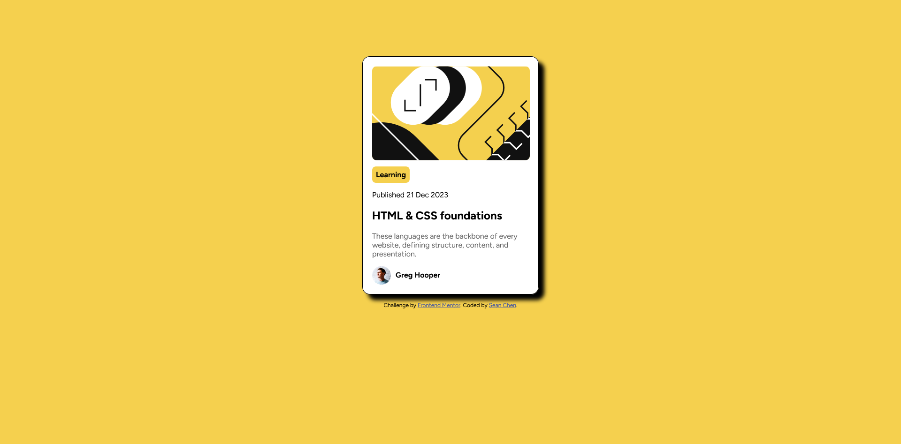

# Frontend Mentor - Blog preview card solution

## Table of contents

- [Overview](#overview)
  - [The challenge](#the-challenge)
  - [Screenshot](#screenshot)
  - [Links](#links)
- [My process](#my-process)
  - [Built with](#built-with)
  - [What I learned](#what-i-learned)
  - [Continued development](#continued-development)
- [Author](#author)
- [Acknowledgments](#acknowledgments)

**Note: Delete this note and update the table of contents based on what sections you keep.**

## Overview

### The challenge

Users should be able to:

- See hover and focus states for all interactive elements on the page

### Screenshot

### Links

- Solution URL: [Add solution URL here](https://your-solution-url.com)
- Live Site URL: [Add live site URL here](https://your-live-site-url.com)

## My process

### Built with

- HTML
- CSS 

### What I learned

For this project, I continued to refine my CSS skills by writing efficient CSS code and doing it myself without relying too much on outside sources. This allowed me to break out of my comfort zone and improve my CSS skills.

### Continued development

Even though I feel comfortable writing vanilla CSS code, I want to get more practice and keep building up my CSS skills.

## Author

- Frontend Mentor - [@chenmeister](https://www.frontendmentor.io/profile/chenmeister)

**Note: Delete this note and add/remove/edit lines above based on what links you'd like to share.**
